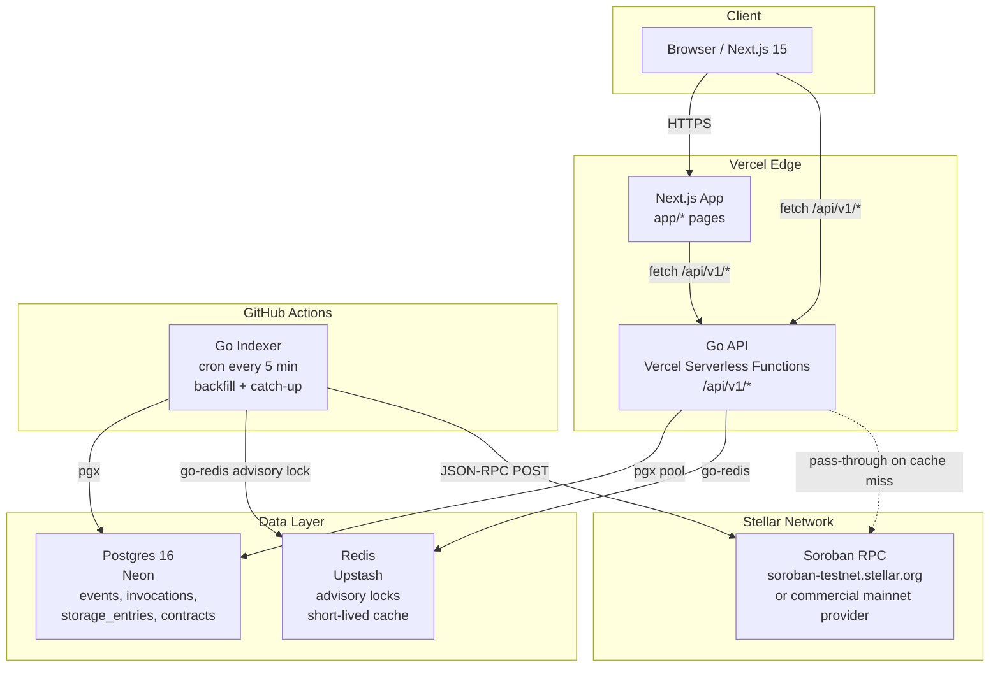

# ARCHITECTURE.md
## Sorolens System Architecture

---

## 1. System Diagram



---

## 2. Data Flow

### 2.1 Backfill of a newly tracked contract

This flow runs when a contract ID is first submitted to the system (either via the dashboard UI or the CLI `sorolens track <contract-id>`).

```
1. API receives POST /api/v1/contracts
   - Validates the contract ID (StrKey C-address format)
   - Calls RPC getNetwork to confirm the node is reachable
   - Calls RPC getLedgerEntries for the contract instance entry
     - If not found: return 404 (contract does not exist on-chain)
   - Inserts row into `contracts` table with status = "backfilling"
   - Returns 201 Accepted

2. On next cron run (at most 5 minutes later), the indexer sees
   the contract in "backfilling" status.

3. Indexer sets a Redis advisory lock:
   SET sorolens:lock:backfill:<contract_id> <job_id> NX PX 300000
   (300-second TTL; if already set, skip this contract for this run)

4. Indexer determines backfill range:
   - Calls RPC getLatestLedger -> current_ledger
   - start_ledger = current_ledger - 120,960 (approximately 7 days at 5s/ledger)
   - If network only retains 24h of events, start_ledger is adjusted to
     current_ledger - 17,280 (approximately 1 day at 5s/ledger)

5. Indexer calls RPC getEvents in paginated batches:
   params: {
     startLedger: start_ledger,
     filters: [{ type: "contract", contractIds: [contract_id] }],
     pagination: { limit: 1000 }
   }
   Repeats with cursor until no more pages.

6. For each event batch:
   - Decode XDR ScVal topics and value (via local XDR lib)
   - Upsert into `events` table (on conflict: skip duplicate by event `id`)

7. For each unique txHash seen in events:
   - Call RPC getTransaction for any txHash not already in `invocations`
   - Parse status, result_xdr, resource fees from resultXdr.feeCharged
   - Upsert into `invocations` table

8. Call RPC getLedgerEntries for the contract instance + any known
   persistent storage keys (empty set on first backfill):
   - Insert/update `storage_entries` table with current liveUntilLedgerSeq

9. Update `contracts` table: status = "active", backfill_complete_at = now()
   Update `sync_state` table: last_ledger = current_ledger

10. Release Redis advisory lock (DELETE key).
```

### 2.2 Incremental catch-up (every cron run)

This flow runs for all contracts in "active" status on every 5-minute cron tick.

```
1. Indexer acquires global Redis advisory lock:
   SET sorolens:lock:global_run <job_id> NX PX 290000
   (290-second TTL; shorter than cron interval to prevent overlap)
   If lock is already held: exit immediately (previous run still in progress).

2. Indexer queries `sync_state` for each tracked contract:
   SELECT contract_id, last_ledger FROM sync_state WHERE status = 'active'

3. Calls RPC getLatestLedger -> current_ledger

4. For each contract, calls RPC getEvents:
   params: {
     startLedger: last_ledger + 1,
     endLedger: current_ledger,
     filters: [{ type: "contract", contractIds: [contract_id] }],
     pagination: { limit: 1000 }
   }
   Paginates until exhausted.

5. Same upsert logic as backfill steps 6-8.

6. Refreshes storage_entries for all keys belonging to active contracts
   by calling getLedgerEntries in batches of 100 keys.

7. Updates sync_state.last_ledger = current_ledger for each contract.

8. Releases global Redis lock.
```

---

## 3. Postgres Schema (DDL)

```sql
-- ============================================================
-- contracts
-- Tracks each contract being observed.
-- ============================================================
CREATE TABLE contracts (
    id             TEXT        PRIMARY KEY,          -- StrKey C-address, e.g. "CDLZFC3S..."
    network        TEXT        NOT NULL,              -- "testnet" | "mainnet"
    label          TEXT,                              -- human-readable name (optional)
    wasm_hash      TEXT,                              -- hex WASM hash from getLedgerEntries
    created_at_ledger  BIGINT,                        -- ledger at which contract was deployed
    backfill_complete_at TIMESTAMPTZ,
    status         TEXT        NOT NULL DEFAULT 'pending',  -- pending | backfilling | active | paused | error
    added_at       TIMESTAMPTZ NOT NULL DEFAULT NOW()
);

-- Fast lookup by network when listing all tracked contracts.
CREATE INDEX idx_contracts_network ON contracts (network);

-- ============================================================
-- events
-- One row per emitted contract event.
-- ============================================================
CREATE TABLE events (
    id             TEXT        PRIMARY KEY,           -- RPC event id, e.g. "0000859036408881152-0000000003"
    contract_id    TEXT        NOT NULL REFERENCES contracts (id),
    ledger         BIGINT      NOT NULL,
    ledger_closed_at TIMESTAMPTZ NOT NULL,
    tx_hash        TEXT        NOT NULL,
    type           TEXT        NOT NULL,              -- "contract" | "system"
    topic_xdr      JSONB       NOT NULL,              -- array of base64 XDR ScVal strings
    value_xdr      TEXT        NOT NULL,              -- base64 XDR ScVal string
    topic_decoded  JSONB,                             -- decoded human-readable topics (null until decoded)
    value_decoded  JSONB,                             -- decoded human-readable value (null until decoded)
    in_successful_call BOOLEAN NOT NULL DEFAULT TRUE,
    inserted_at    TIMESTAMPTZ NOT NULL DEFAULT NOW()
);

-- Primary query pattern: all events for a contract, newest first.
CREATE INDEX idx_events_contract_ledger ON events (contract_id, ledger DESC);

-- Support filtering by transaction hash (e.g. "show all events in this tx").
CREATE INDEX idx_events_tx_hash ON events (tx_hash);

-- Time-range queries from the dashboard.
CREATE INDEX idx_events_ledger_closed_at ON events (ledger_closed_at DESC);

-- "Events for contract X within time range Y" (migration 000009).
CREATE INDEX idx_events_contract_id_ledger_closed_at ON events (contract_id, ledger_closed_at);

-- ============================================================
-- invocations
-- One row per transaction that invoked (or attempted to invoke)
-- a tracked contract.
-- ============================================================
CREATE TABLE invocations (
    tx_hash            TEXT        PRIMARY KEY,
    contract_id        TEXT        NOT NULL REFERENCES contracts (id),
    ledger             BIGINT      NOT NULL,
    ledger_closed_at   TIMESTAMPTZ NOT NULL,
    status             TEXT        NOT NULL,          -- SUCCESS | FAILED | NOT_FOUND
    function_name      TEXT,                          -- decoded from diagnosticEventsXdr fn_call, may be null
    args_decoded       JSONB,                         -- decoded function arguments, may be null
    result_decoded     JSONB,                         -- decoded return value, may be null
    result_xdr         TEXT,                          -- raw base64 TransactionResult XDR
    resource_fee_charged BIGINT,                      -- in stroops, from TransactionResult.feeCharged
    cpu_insn           BIGINT,                        -- from core_metrics diagnostic event
    mem_byte           BIGINT,                        -- from core_metrics diagnostic event
    ledger_read_byte   BIGINT,                        -- from core_metrics diagnostic event
    ledger_write_byte  BIGINT,                        -- from core_metrics diagnostic event
    application_order  INTEGER,                       -- index of tx within the ledger
    inserted_at        TIMESTAMPTZ NOT NULL DEFAULT NOW()
);

-- Primary query pattern: all invocations for a contract, newest first.
CREATE INDEX idx_invocations_contract_ledger ON invocations (contract_id, ledger DESC);

-- Lookup by ledger close time for time-range dashboard queries.
CREATE INDEX idx_invocations_ledger_closed_at ON invocations (ledger_closed_at DESC);

-- Filter by status (e.g. "show only failed invocations").
CREATE INDEX idx_invocations_status ON invocations (contract_id, status);

-- ============================================================
-- storage_entries
-- Snapshot of current contract storage state.
-- Updated on every indexer run for all active contracts.
-- ============================================================
CREATE TABLE storage_entries (
    id                     BIGSERIAL   PRIMARY KEY,
    contract_id            TEXT        NOT NULL REFERENCES contracts (id),
    key_xdr                TEXT        NOT NULL,       -- base64 XDR LedgerKey
    key_decoded            JSONB,                      -- decoded key (null until decoded)
    value_xdr              TEXT,                       -- base64 XDR LedgerEntry (null if archived)
    value_decoded          JSONB,                      -- decoded value (null until decoded or if archived)
    durability             TEXT        NOT NULL,       -- "temporary" | "persistent" | "instance"
    live_until_ledger      BIGINT,                     -- liveUntilLedgerSeq from getLedgerEntries; null if archived
    last_modified_ledger   BIGINT,
    status                 TEXT        NOT NULL DEFAULT 'live',  -- live | archived | deleted
    last_seen_at           TIMESTAMPTZ NOT NULL DEFAULT NOW(),
    UNIQUE (contract_id, key_xdr)
);

-- TTL health dashboard: "show all entries expiring within N ledgers".
CREATE INDEX idx_storage_live_until ON storage_entries (contract_id, live_until_ledger ASC)
    WHERE status = 'live';

-- Filter by durability type.
CREATE INDEX idx_storage_durability ON storage_entries (contract_id, durability);

-- ============================================================
-- sync_state
-- One row per tracked contract, tracking indexer cursor position.
-- ============================================================
CREATE TABLE sync_state (
    contract_id    TEXT        PRIMARY KEY REFERENCES contracts (id),
    last_ledger    BIGINT      NOT NULL DEFAULT 0,     -- last fully-processed ledger
    last_run_at    TIMESTAMPTZ,
    error_message  TEXT,                               -- last error, if any
    updated_at     TIMESTAMPTZ NOT NULL DEFAULT NOW()
);

-- ============================================================
-- storage_entry_history
-- Append-only history of storage entries (migration 000005). Every write
-- to storage_entries also appends a versioned row here, so the snapshot/
-- replay endpoint can answer "what was live at ledger N?".
-- ============================================================
CREATE TABLE storage_entry_history (
    id                   BIGSERIAL   PRIMARY KEY,
    contract_id          TEXT        NOT NULL,
    key_xdr              TEXT        NOT NULL,
    key_decoded          JSONB,
    value_xdr            TEXT,
    value_decoded        JSONB,
    durability           TEXT        NOT NULL,
    live_until_ledger    BIGINT,
    last_modified_ledger BIGINT,
    status               TEXT        NOT NULL DEFAULT 'live',
    recorded_at          TIMESTAMPTZ NOT NULL DEFAULT NOW(),
    UNIQUE (contract_id, key_xdr, last_modified_ledger)
);

CREATE INDEX idx_storage_history_lookup
    ON storage_entry_history (contract_id, key_xdr, last_modified_ledger DESC);

-- ============================================================
-- api_keys
-- Scoped API credentials (migration 000004). Only the SHA-256 hash of the
-- plaintext token is stored; the token is shown once at creation.
-- ============================================================
CREATE TABLE api_keys (
    id           TEXT        PRIMARY KEY,
    name         TEXT        NOT NULL,
    key_prefix   TEXT        NOT NULL,
    key_hash     TEXT        NOT NULL UNIQUE,
    scopes       TEXT[]      NOT NULL DEFAULT '{}',
    created_at   TIMESTAMPTZ NOT NULL DEFAULT NOW(),
    last_used_at TIMESTAMPTZ,
    revoked_at   TIMESTAMPTZ
);

CREATE INDEX idx_api_keys_hash ON api_keys (key_hash) WHERE revoked_at IS NULL;

-- ============================================================
-- multi-network (migration 000003)
-- events, invocations, storage_entries, and monitored_contracts gained a
-- `network` column defaulting to 'testnet', so the indexer and API can track
-- testnet, mainnet, and futurenet simultaneously. Existing rows are
-- backfilled to 'testnet' for backward compatibility.
-- ============================================================
```

### Index justifications

| Index | Justification |
|---|---|
| `idx_contracts_network` | Dashboard lists contracts per network; network filter is the most common WHERE clause on the contracts table. |
| `idx_events_contract_ledger` | The most common dashboard query: "show me recent events for contract X." Composite index with ledger DESC avoids sort. |
| `idx_events_tx_hash` | Supports the invocation-detail page which shows all events emitted in a given transaction. |
| `idx_events_ledger_closed_at` | Time-range filtering on the events feed. |
| `idx_events_contract_id_ledger_closed_at` | Backs "events for contract X within time range Y" (contract stats window, daily activity aggregate). Leading on both columns bounds the scan; the contract/ledger index still reads every event for the contract and filters on `ledger_closed_at`. |
| `idx_invocations_contract_ledger` | Same pattern as events; the invocation list is paginated with newest-first ordering. |
| `idx_invocations_ledger_closed_at` | Time-range filter for resource-usage charts. |
| `idx_invocations_status` | Supports the "show only failures" filter on the invocations list. |
| `idx_storage_live_until` | The TTL health view needs to order by `live_until_ledger ASC` for a given contract; partial index on `status = 'live'` avoids scanning archived rows. |
| `idx_storage_durability` | Supports filtering the storage view by entry type. |

---

## 4. REST API: `/api/v1`

All routes return `Content-Type: application/json`. Errors follow:

```json
{ "error": "human readable message", "code": "ERROR_CODE" }
```

Cursor pagination uses an opaque `cursor` token (base64 of `{ledger}:{id}`) rather than offset. This is safe against inserts during pagination and aligns with how the RPC itself paginates.

#### Authentication and scopes

Every list endpoint accepts an optional `?network=testnet|mainnet|futurenet`
filter (omitted or `all` means every network).

Requests may carry a scoped API key via `Authorization: Bearer <token>` or
`X-API-Key: <token>`. Scope enforcement is driven by a route metadata table
keyed by the chi route pattern (`internal/middleware/scopes.go`):

| Scope | Grants |
|---|---|
| `read:contracts` | contract, event, invocation, storage, stats, and snapshot reads |
| `write:contracts` | `POST /api/v1/contracts` |
| `read:watchdog` | all `/api/v1/watchdog/*` reads |
| `admin:*` | everything, including API key management |

A presented key that lacks the required scope receives `403` with
`{"error":"missing scope","required":"<scope>"}`. Unknown or revoked keys
receive `401`. Requests that present no credential keep the public v0.1 read
surface open; API key management always requires a credential.

---

### 4.1 Contracts

#### `POST /api/v1/contracts`

Register a contract for tracking.

**Request body:**
```json
{
  "contract_id": "CDLZFC3SYJYDZT7K67VZ75HPJVIEUVNIXF47ZG2FB2RMQQVU2HHGCYSC",
  "network": "testnet",
  "label": "My Token Contract"
}
```

**Responses:**
- `201 Created`: contract accepted for backfill.
- `400 Bad Request`: invalid contract ID format or missing fields.
- `404 Not Found`: contract does not exist on-chain (getLedgerEntries returned no entry).
- `409 Conflict`: contract already being tracked.

---

#### `GET /api/v1/contracts`

List all tracked contracts.

**Query params:** `network` (filter by network), `status` (filter by status).

**Response `200`:**
```json
{
  "contracts": [
    {
      "id": "CDLZFC3S...",
      "network": "testnet",
      "label": "My Token Contract",
      "status": "active",
      "wasm_hash": "a1b2c3d4...",
      "added_at": "2026-07-01T10:00:00Z"
    }
  ]
}
```

---

#### `GET /api/v1/contracts/:id`

Get a single contract's metadata and sync state.

**Response `200`:**
```json
{
  "id": "CDLZFC3S...",
  "network": "testnet",
  "label": "My Token Contract",
  "status": "active",
  "wasm_hash": "a1b2c3d4...",
  "backfill_complete_at": "2026-07-01T10:05:00Z",
  "sync": {
    "last_ledger": 490252,
    "last_run_at": "2026-07-26T10:00:00Z"
  },
  "storage_entry_count": 42,
  "expiring_entry_count": 3
}
```

**Responses:** `200`, `404 Not Found`.

---

#### `DELETE /api/v1/contracts/:id`

Stop tracking a contract. Data is retained but the indexer stops polling.

**Response:** `204 No Content`.

---

### 4.2 Events

#### `GET /api/v1/contracts/:id/events`

Paginated event list for a contract.

**Query params:**

| Param | Type | Default | Notes |
|---|---|---|---|
| `cursor` | string | (none) | Opaque cursor from previous response. |
| `limit` | integer | 50 | Max 500. |
| `topic` | string | (none) | Filter: match events where topic[0] decodes to this symbol string. |
| `tx_hash` | string | (none) | Filter by transaction hash. |
| `since` | ISO-8601 | (none) | Return events after this timestamp. |
| `until` | ISO-8601 | (none) | Return events before this timestamp. |

**Response `200`:**
```json
{
  "events": [
    {
      "id": "0000859036408881152-0000000003",
      "ledger": 200010,
      "ledger_closed_at": "2025-06-30T07:27:13Z",
      "tx_hash": "d9e771ac...",
      "type": "contract",
      "topic_decoded": ["transfer", "GABC...", "GDEF..."],
      "value_decoded": "1000000000",
      "in_successful_call": true
    }
  ],
  "cursor": "0000863490289963008-0000000010",
  "has_more": true
}
```

#### `GET /api/v1/events`

Cross-contract events explorer feed (all tracked contracts), **newest first**.
Backs the dashboard's `/events` page.

| Param | Type | Default | Notes |
|---|---|---|---|
| `cursor` | string | (none) | Opaque cursor from the previous page's `next_cursor`. |
| `limit` | integer | 50 | Max 200. |
| `contract_id` | string | (none) | Contract ID prefix, case-insensitive; a full ID matches one contract. `%` and `_` match literally. |
| `type` | string | (none) | `contract`, `system` or `diagnostic`. |
| `network` | string | (none) | `testnet`, `mainnet`, `futurenet` or `standalone`. |
| `since` / `until` | RFC 3339 | (none) | Inclusive bounds on `ledger_closed_at`. |

**Response `200`:** `{ "events": [Event + contract_id, network], "next_cursor": "…" }`.
`next_cursor` is empty on the last page. The keyset cursor is the event ID
(a ledger-ordered RPC paging token), so pages stay stable while new events
are indexed.

---

### 4.3 Invocations

#### `GET /api/v1/contracts/:id/invocations`

Paginated invocation list.

**Query params:** `cursor`, `limit` (max 500), `status` (`SUCCESS`/`FAILED`), `since`, `until`, `function_name`.

**Response `200`:**
```json
{
  "invocations": [
    {
      "tx_hash": "32f7e5c3...",
      "ledger": 490252,
      "ledger_closed_at": "2026-07-26T10:00:21Z",
      "status": "SUCCESS",
      "function_name": "transfer",
      "args_decoded": { "from": "GABC...", "to": "GDEF...", "amount": "1000000000" },
      "result_decoded": null,
      "resource_fee_charged": 123456,
      "cpu_insn": 4883530,
      "mem_byte": 2298162,
      "ledger_read_byte": 21812,
      "ledger_write_byte": 1808
    }
  ],
  "cursor": "490200:abc123",
  "has_more": false
}
```

---

#### `GET /api/v1/contracts/:id/invocations/:tx_hash`

Full detail for a single invocation, including all associated events.

**Response `200`:**
```json
{
  "tx_hash": "32f7e5c3...",
  "ledger": 490252,
  "ledger_closed_at": "2026-07-26T10:00:21Z",
  "status": "SUCCESS",
  "function_name": "transfer",
  "args_decoded": { ... },
  "result_decoded": null,
  "result_xdr": "AAAAAAAHNm8A...",
  "resource_fee_charged": 123456,
  "cpu_insn": 4883530,
  "mem_byte": 2298162,
  "ledger_read_byte": 21812,
  "ledger_write_byte": 1808,
  "events": [ ... ]
}
```

**Responses:** `200`, `404 Not Found`.

---

### 4.4 Storage Entries

#### `GET /api/v1/contracts/:id/storage`

Paginated storage entry list.

**Query params:** `cursor`, `limit` (max 200), `durability` (`temporary`/`persistent`/`instance`), `status` (`live`/`archived`), `expiring_within` (integer: show only entries with `live_until_ledger - current_ledger <= N`).

**Response `200`:**
```json
{
  "current_ledger": 490314,
  "entries": [
    {
      "key_xdr": "AAAA...",
      "key_decoded": "Balance",
      "value_xdr": "AAAABg...",
      "value_decoded": { "GABC...": "1000000000" },
      "durability": "persistent",
      "live_until_ledger": 490600,
      "ledgers_until_expiry": 286,
      "status": "live",
      "last_modified_ledger": 489200
    }
  ],
  "cursor": "490200:key123",
  "has_more": true
}
```

---

### 4.5 Snapshot / replay

#### `GET /api/v1/contracts/:id/snapshot?ledger=N`

Replays the contract's storage state and last known event as they were at
ledger `N`. Used by the ledger scrubber on the contract detail page.

**Responses:**
- `200`: `{ contract_id, network, ledger, first_tracked_ledger, storage, last_event }`.
- `404`: contract is unknown, or `N` precedes the first ledger the contract
  was tracked at (the message names that ledger).
- `422`: `ledger` is missing or not a positive integer.

---

### 4.6 API keys

Scoped credentials are managed under `/api/v1/api-keys` and require the
`admin:*` scope.

#### `POST /api/v1/api-keys`

Create a key. Body: `{ "name": string, "scopes": string[] }`. Returns `201`
with the plaintext `key` exactly once; only its SHA-256 hash is persisted.

#### `GET /api/v1/api-keys`

List key metadata (never the token).

#### `DELETE /api/v1/api-keys/:id`

Revoke a key. Returns `204`.

---

### 4.7 Stats

#### `GET /api/v1/stats/global`

Network-wide summary across all tracked contracts.

**Response `200`:**
```json
{
  "tracked_contracts": 12,
  "total_events_indexed": 48210,
  "total_invocations_indexed": 9347,
  "failed_invocation_count": 134,
  "avg_cpu_insn_last_1000": 5234000,
  "avg_resource_fee_last_1000": 98234,
  "expiring_storage_entries_7d": 8,
  "oldest_indexed_ledger": 400000,
  "latest_indexed_ledger": 490314,
  "indexer_last_run_at": "2026-07-26T10:00:01Z"
}
```

---

### 4.8 Dashboard summary

#### `GET /api/v1/contracts/:id/summary`

Composite document for the contract dashboard: totals, the newest event, the
newest invocation, and the cached health score, so a page load costs one
request instead of four. Each sub-query is an aggregate or a `LIMIT 1` newest-row
lookup, so the work per request is constant (no per-row queries). Responses are
memoized in-process for 5 seconds.

**Responses:**
- `200`: `{ contract_id, network, label, status, generated_at, stats, latest_event, latest_invocation, health_score }`.
  `latest_event`, `latest_invocation`, and `health_score` are `null` until the
  indexer has produced the corresponding data.
- `404`: the contract is unknown.

---

### 4.9 Alert notification channels

Critical watchdog alerts are delivered to subscribed channels, each in its
native format (`services/indexer/internal/watchdog/notifier.go`):

| `channel_type` | Destination | Payload |
|---|---|---|
| `webhook` | any http(s) URL | Generic JSON (`contract_id`, `severity`, `message`, `timestamp`, `explorer_url`). |
| `slack` | Slack incoming webhook (https) | Block Kit: header, contract/severity fields, message, ledger/time context, "View transaction" button. |
| `discord` | Discord channel webhook (https) | One embed, colored by severity, with contract/severity/ledger fields. |
| `pagerduty` | Events API v2 (`routing_key`) | `trigger` event; severity mapped Critical→`critical`, Warning→`warning`, Info→`info`; `dedup_key` = `sorolens:<contract>:<tx>` so a re-delivered alert does not open a second incident. |

A 5xx response is retried once; a 4xx is logged and skipped.

#### `POST /api/v1/watchdog/subscriptions`

Contributor role. Body: `{ contract_id, channel_type?, webhook_url?, routing_key?, severity_filter? }`.
`webhook_url` is required for webhook/slack/discord (https for slack and
discord); `routing_key` is required for pagerduty and rejected otherwise. The
contract must be monitored by the watchdog (`422` otherwise).

#### `GET /api/v1/watchdog/subscriptions` · `DELETE /api/v1/watchdog/subscriptions/:id`

Contributor role. Responses never contain secrets: Slack/Discord webhook URLs
are masked (`https://hooks.slack.com/services/***`) and the PagerDuty key is
reported only as `has_routing_key`. `DELETE` returns `204`, or `404` for an
unknown ID.

#### `POST /integrations/slack/commands`

Slack slash command (`/sorolens <contract_id>`), outside `/api/v1` because
Slack posts form-encoded bodies. Each request is verified against
`SLACK_SIGNING_SECRET` (HMAC-SHA256 of `v0:<timestamp>:<body>`, constant-time
compare) and rejected with `401` if the signature is wrong or the timestamp is
more than five minutes old. Replies with an ephemeral Block Kit status message.
Returns `404` when no signing secret is configured.

---

### 4.10 Response caching and metrics

`GET /api/v1/contracts`, `GET /api/v1/contracts/:id` and
`GET /api/v1/watchdog/stats` are cached in Redis for `API_CACHE_TTL`
(default 30s), keyed by method, path and sorted query string under a namespace
(`sorolens:cache:<namespace>:…`). Only `200` responses are stored, and scope
checks run before the cache. A successful `POST /api/v1/contracts` purges the
`contracts` namespace (SCAN + UNLINK) before the response is sent; watchdog
stats are written by the indexer, so they expire by TTL. Redis errors fail
open. Responses carry `X-Cache: HIT|MISS`, and hit/miss counters are exposed
on `GET /metrics` (see `docs/metrics.md`).

The full machine-readable reference is [`docs/openapi.yaml`](docs/openapi.yaml);
`make openapi` checks it covers every route, lints it, and regenerates the Go
client.

---

## 5. Design Decisions with Rationale

### 5.1 Cron-driven indexer over a persistent worker

**Decision:** The indexer runs as a GitHub Actions scheduled workflow on a 5-minute cron, not as a long-running process.

**Rationale:**
- Zero hosting cost (GitHub Actions free tier covers this comfortably at 5-minute intervals for a small number of contracts).
- No server to maintain or restart. Vercel and Neon are both serverless; the indexer being serverless is architecturally consistent.
- GitHub Actions provides logging, history, and alerting for free.

**Tradeoffs:**
- 5-minute minimum latency for new events. For an observability tool (not a trading system), this is acceptable.
- Cold start on each run adds a few seconds of overhead.
- Cannot hold long-running TCP connections to Soroban RPC (not needed; RPC is HTTP).

**Migration path to a persistent worker:** When event volume or contract count makes 5-minute cron latency unacceptable, extract the indexer binary and run it as a Fly.io Machine (free tier) or a Railway worker. The indexer already exposes a `Run()` function with a configurable poll interval; no structural change is required. The Redis advisory lock mechanism is already in place to prevent duplicate runs regardless of how the indexer is deployed.

---

### 5.2 HTTP polling over SSE for the live-tail

**Decision:** The dashboard live-tail polls `GET /api/v1/contracts/:id/events` every 5 seconds instead of opening a long-lived SSE stream.

**Rationale:** Vercel serverless functions have a maximum execution time (approximately 60 seconds for Pro, 10 seconds for free). Long-lived SSE connections are not supported on Vercel serverless. HTTP polling with a 5-second interval and a cursor is the only viable approach without a separate persistent WebSocket server.

**Tradeoffs:** 5-second polling is slightly higher latency than SSE and uses more requests. For an observability tool where data is already indexed with 5-minute granularity, this is acceptable. Clients deduplicate by event `id`.

**Migration path:** If Sorolens is ever deployed with a persistent server, replace the polling client code with an SSE or WebSocket endpoint backed by a Go `net/http` SSE handler. The API contract (cursor-based event list) does not change.

---

### 5.3 Redis advisory lock for single-writer indexer runs

**Decision:** Before each indexer run, the indexer acquires a Redis key with `SET ... NX PX <ttl>`. If the key already exists, the run exits immediately.

**Rationale:** GitHub Actions cron workflows can overlap if a previous run is still in progress. Two concurrent indexer processes writing to Postgres would produce duplicate events and undefined `sync_state` updates. The Redis lock provides a cheap, stateless mutual exclusion mechanism with automatic expiry (the lock self-releases if the indexer crashes without deleting it).

Upstash Redis is used because it is serverless (no idle cost), has a free tier, and supports the standard Redis `SET NX PX` command.

**Lock TTL:** 290 seconds (just under the 5-minute cron interval). This ensures the lock always expires before the next cron tick, even if the indexer crashes without releasing it explicitly.

---

### 5.4 Cursor pagination over offset

**Decision:** All list endpoints use cursor-based pagination via an opaque `cursor` string, not `?page=N&limit=M` offset pagination.

**Rationale:**
- Events and invocations are append-only. During pagination, new rows are inserted. Offset pagination produces duplicate or missing rows if a page boundary shifts between requests.
- Cursor pagination is stable: the cursor encodes the position (ledger + id) of the last returned row, not an offset.
- Aligns with how Soroban RPC itself paginates `getEvents`.
- Postgres `WHERE (ledger, id) < (cursor_ledger, cursor_id) ORDER BY ledger DESC, id DESC LIMIT N` uses the composite index efficiently.

**Tradeoff:** Clients cannot jump to an arbitrary page number. This is acceptable for an observability dashboard where users scroll through a feed; it is not a spreadsheet export use case.
